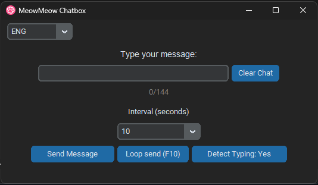
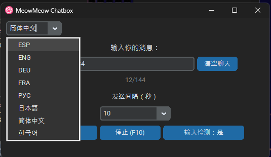
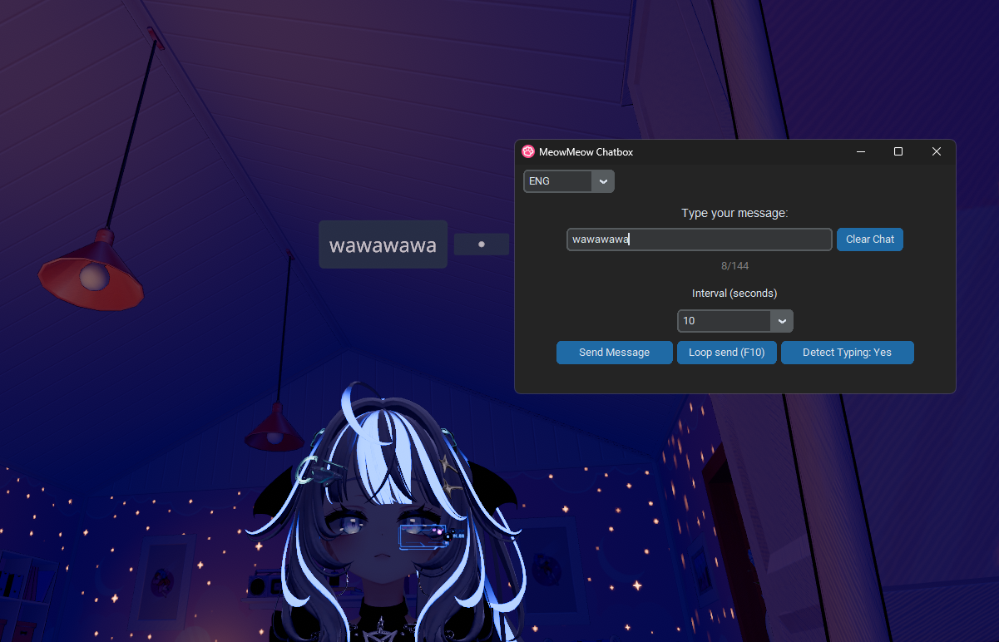
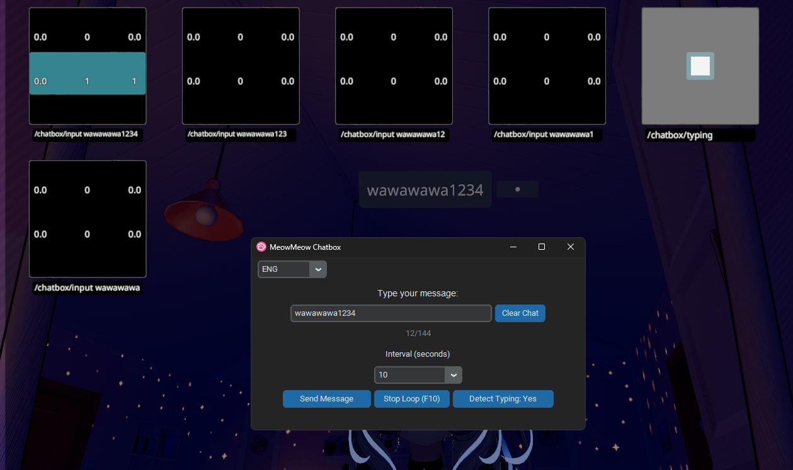

<b><H1>MeowMeow Chatbox v1.0 Release</H1></b>
 
   
<b>An easy and simple tool to control your chatbox in VRChat.</b>
 
   
  

**Functions:**

- Sends messages automatically from the text box. Press F10 to send the message repeatedly.

- Change time intervals from a list ranging from 2 seconds up to 30 seconds.

- VRChat will detect typing as usual and show it as three dots (...) in-game.
You can disable typing detection manually if you don't want it to register every key.

- Send Once (or press Enter): The message is sent regardless of what you've typed in-game.
- Clear Chat: Deletes text from the text box and from the VRChat chatbox.

- **Support for multiple languages!! <3**
Spanish, English, German, French, Russian, Japanese, Simplified Chinese, and Korean <3

Maximum length: 144 characters (VRChat limit)
 
 
<b><h2>New Functions! (From v1.1)</b>
</h2>
You can now use any device from your network!

Go to OSC settings and enter your device IP (where VRChat is open)

Video on Youtube: 

   
   
<b>Multi-Language Support:</b>
 

<b>Usage in VRChat:<b/>

<b>Debug View:<b/>

